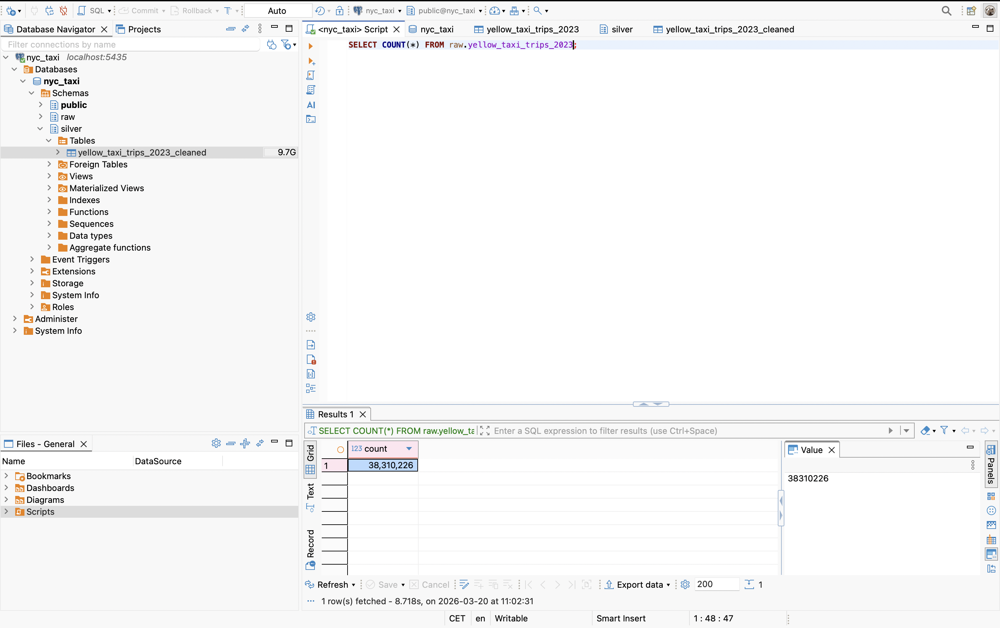
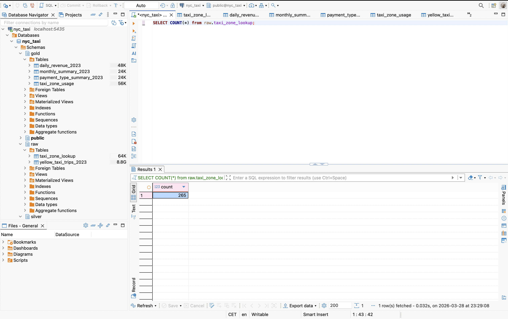
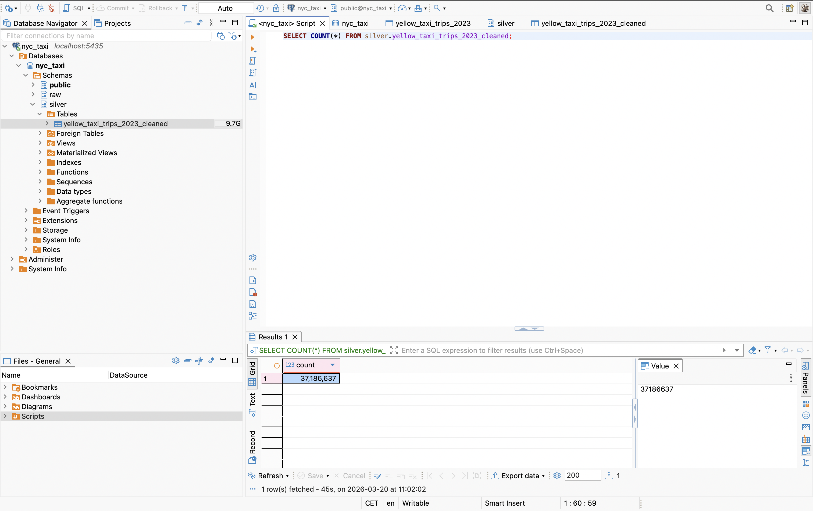

# Data issues

## Data Quality Issues – NYC Taxi Dataset (2023)

During the exploratory analysis of the raw dataset, several data quality issues were identified. Below are three key anomalies detected in the data.

---

### 1. Zero or Negative Trip Distance

Some records contain trips with a distance equal to zero or even negative values.

This is problematic because:

* A taxi trip should always have a positive distance
* Zero distance may indicate canceled rides or incorrect measurements
* Negative values are clearly invalid and suggest data corruption

These records were identified using the following logic:

```sql
WHERE trip_distance <= 0
```


---

### 2. Non-positive Fare Amount

There are trips where the fare amount is zero or negative.

Possible reasons include:

* Data entry errors
* Refunds or adjustments incorrectly recorded
* Test or invalid transactions

Such values are not valid for standard taxi operations, as every trip should generate a positive fare.

Detection logic:

```sql
WHERE fare_amount <= 0
```


---

### 3. Invalid Timestamp Order (Pickup After Dropoff)

Some trips have inconsistent timestamps where the pickup time occurs after the dropoff time.

This is logically impossible and indicates:

* Data ingestion errors
* Corrupted timestamps
* System synchronization issues

Detection logic:

```sql
WHERE tpep_pickup_datetime > tpep_dropoff_datetime
```


## Additional Data Quality Risks

Beyond the detected anomalies in the dataset, several potential risks were identified across different stages of the ELT process, including ingestion, transformation, data consumption, and scalability.

---

### 1. Data Ingestion Risks

During the ingestion process, the following risks were identified:

- **Schema inconsistencies across files**: different parquet files may contain missing columns or differently named fields (e.g. `Airport_fee` vs `airport_fee`), leading to incorrect column mapping or data loss.
- **Missing or incomplete data**: some columns may be absent in certain files, requiring default values (NULLs), which can impact downstream processing.
- **Risk of duplicate data loads**: re-running ingestion scripts without deduplication logic may result in duplicated records in the raw layer.

These issues were mitigated through column normalization and controlled ingestion logic.

---

### 2. Transformation Risks

During the transformation process (raw → silver), the following risks were identified:

- **Invalid data values**: records with negative or zero trip distance, non-positive fare amounts, or incorrect timestamps (pickup after dropoff).
- **Impact of data cleaning on aggregations**: removing invalid records improves data quality but may slightly alter total counts and revenue metrics compared to raw data.

Rows number in raw data:



Rows number in silver data:



- **Incorrect data types**: functions such as `EXTRACT()` may produce numeric values instead of integers if not explicitly cast, leading to inconsistencies across layers.

These risks highlight the importance of clearly defined transformation rules and explicit type handling.

---

### 3. Data Consistency and Consumption Risks

In the analytical (gold) layer, potential risks include:

- **Lack of constraints**: without primary keys and NOT NULL constraints, datasets may contain duplicates or NULL values that can distort aggregations.
- **Null propagation**: missing values in intermediate layers may propagate into aggregated tables if not handled properly.
- **Inconsistent metric definitions**: differences in aggregation logic across tables may lead to inconsistent analytical results.

These risks were mitigated by introducing primary keys, NOT NULL constraints, and consistent aggregation logic.

---

### 4. Scalability and Performance Risks

Due to the size of the dataset (~8–9 GB), several scalability challenges may arise:

- slower query performance on large datasets,
- increased memory and storage usage in local environments,
- potential data type limitations (e.g. using INT instead of BIGINT for large counts).

In production environments, these issues should be addressed through indexing, partitioning, and optimized data types.

---

### 5. Timestamp and Temporal Consistency Risks

Timestamp fields may introduce additional risks:

- incorrect ordering (pickup after dropoff),
- inconsistent formats,
- potential timezone-related issues.

These problems can significantly affect time-based aggregations and trend analysis in the gold layer.

---

### 6. Data Sharing and Consumption Risks

In the final (gold) layer, additional risks related to data sharing and usage were identified:

- **Ambiguity in metric definitions**: without clear documentation, users may misinterpret metrics such as revenue or trip counts.
- **Lack of standardization**: inconsistent naming conventions or data types across tables may lead to confusion during analysis.
- **Data accessibility issues**: without proper structuring, aggregated tables may not be easily usable for reporting or BI tools.
- **Risk of misuse**: users may join or filter data incorrectly if relationships between tables are not clearly defined.

To mitigate these risks, the gold layer was designed to:
- provide clean, aggregated, and business-ready datasets,
- enforce consistent naming and data types,
- include primary keys and NOT NULL constraints,
- simplify data structures for analytical consumption.

This highlights the importance of designing clear, well-structured, and standardized datasets to ensure reliable data consumption and accurate analytical outcomes.

---
