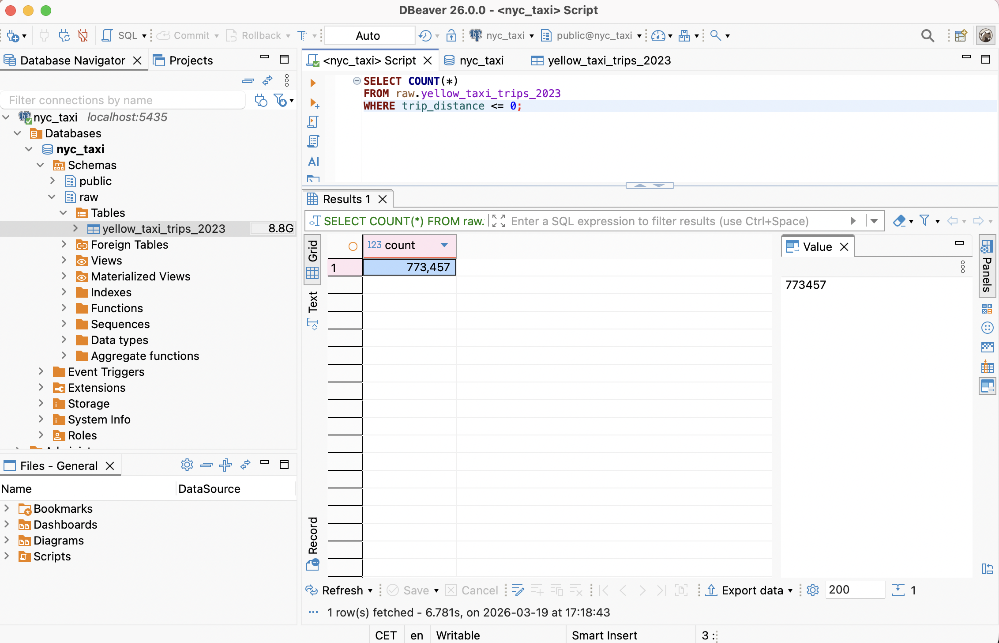
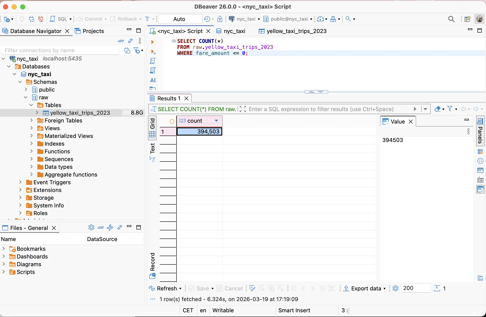
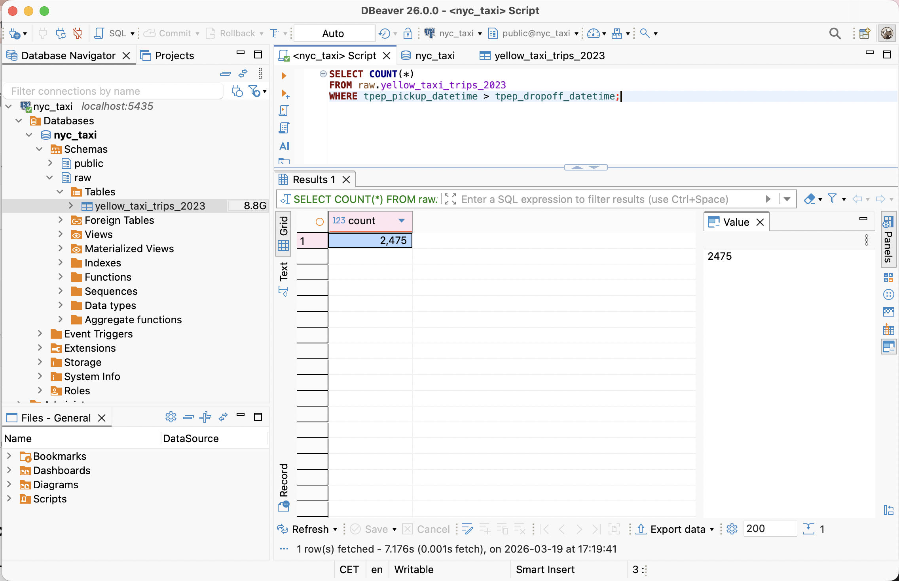

# Data issues

## Data Quality Issues – NYC Taxi Dataset (2023)

During the exploratory analysis of the raw dataset, several data quality issues were identified. Below are three key anomalies detected in the data.

---

### 1. Zero or Negative Trip Distance

Some records contain trips with a distance equal to zero or even negative values.

This is problematic because:

* A taxi trip should always have a positive distance
* Zero distance may indicate canceled rides or incorrect measurements
* Negative values are clearly invalid and suggest data corruption

These records were identified using the following logic:

```sql
WHERE trip_distance <= 0
```



---

### 2. Non-positive Fare Amount

There are trips where the fare amount is zero or negative.

Possible reasons include:

* Data entry errors
* Refunds or adjustments incorrectly recorded
* Test or invalid transactions

Such values are not valid for standard taxi operations, as every trip should generate a positive fare.

Detection logic:

```sql
WHERE fare_amount <= 0
```



---

### 3. Invalid Timestamp Order (Pickup After Dropoff)

Some trips have inconsistent timestamps where the pickup time occurs after the dropoff time.

This is logically impossible and indicates:

* Data ingestion errors
* Corrupted timestamps
* System synchronization issues

Detection logic:

```sql
WHERE tpep_pickup_datetime > tpep_dropoff_datetime
```




---

## Data Processing Summary (Raw → Silver → Gold)

### Raw Layer

The raw layer contains data ingested directly from parquet files without any transformations.
At this stage, the dataset may include invalid, inconsistent, or incomplete records.

The ingestion process was implemented using a Python script:

```
scripts/load_to_raw.py
```

Data is loaded into the table:

```
raw.yellow_taxi_trips_2023
```

This layer serves as a reliable source of truth and preserves original data for traceability.

---

### Silver Layer (Data Cleaning)

The silver layer introduces data quality rules and filters out invalid records identified during exploratory analysis.

Transformation logic is implemented in:

```
sql/silver/raw_to_silver.sql
```

Cleaned data is stored in:

```
silver.yellow_taxi_trips_2023_cleaned
```

The following transformations were applied:

* Removed records with non-positive trip distance (`trip_distance <= 0`)
* Removed records with non-positive fare amount (`fare_amount <= 0`)
* Removed records with invalid timestamps (`pickup > dropoff`)
* Restricted dataset to the year 2023
* Derived additional fields:

  * `pickup_date`
  * `pickup_year`
  * `pickup_month`
  * `trip_duration_minutes`

This step ensures that the dataset is consistent, reliable, and ready for analytical processing.

---

### Gold Layer (Aggregations & Analytics)

The gold layer contains aggregated, business-ready tables designed for analysis and reporting.

Transformation scripts:

```
sql/gold/silver_to_gold_daily_revenue.sql
sql/gold/silver_to_gold_monthly_summary.sql
sql/gold/silver_to_gold_payment_type.sql
```

Output tables:

```
gold.daily_revenue_2023
gold.monthly_summary_2023
gold.payment_type_summary_2023
```

These tables provide:

* **daily_revenue_2023**

  * Daily number of trips
  * Total revenue
  * Average trip revenue, distance, and duration
 


* **monthly_summary_2023**

  * Monthly aggregation of trips and revenue
  * Average fare and key metrics


* **payment_type_summary_2023**

  * Breakdown of trips and revenue by payment type
  * Average total and tip amounts


---

### Key Observations

* Data quality issues in the raw layer required explicit filtering
* The silver layer ensures data integrity before analysis
* Gold tables significantly reduce data volume and improve query performance
* The layered architecture improves maintainability and clarity of the pipeline

---

### Conclusion

The implemented pipeline follows a standard data engineering pattern (raw → silver → gold), enabling:

* Clear separation of ingestion, transformation, and analytics
* Reproducibility and traceability
* Reliable analytical outputs

The dataset is now ready for reporting, dashboards, or further analytical use cases.

---

