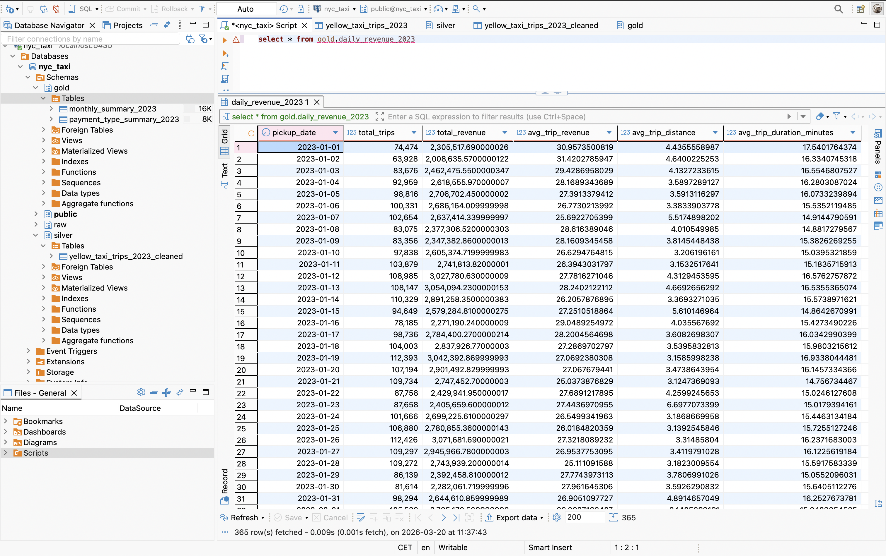
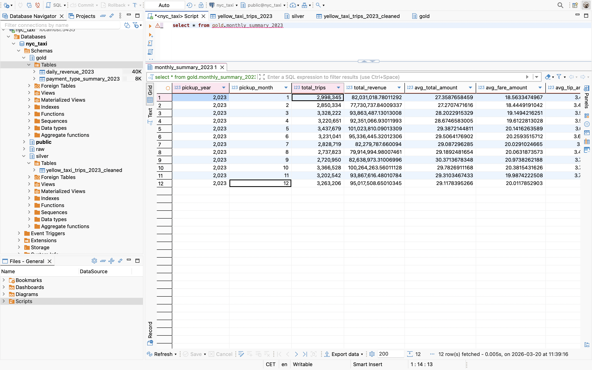
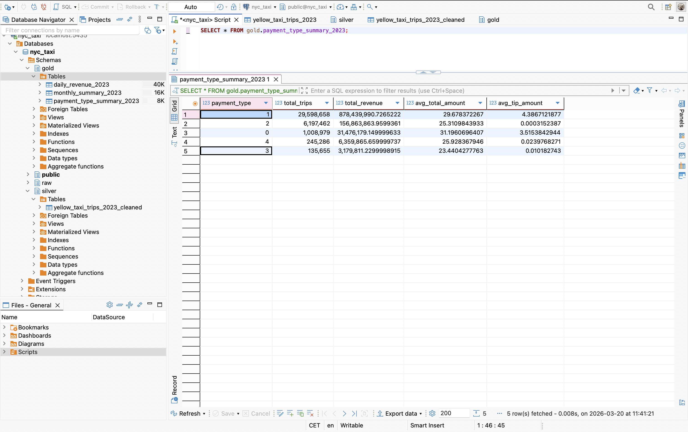
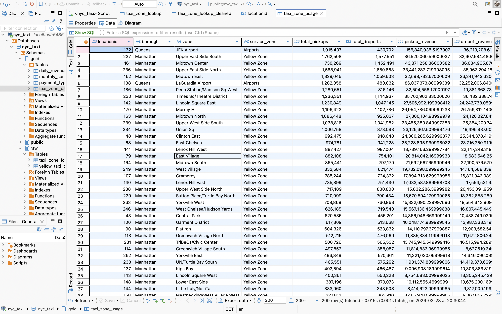

## Data Processing Summary (Raw → Silver → Gold)

### Raw Layer

The raw layer contains data ingested directly from parquet files without any transformations (for yellow taxi trips) and csv file named taxi_zone_lookup.
At this stage, the dataset may include invalid, inconsistent, or incomplete records.

The ingestion process was implemented using a Python scripts:

```
scripts/load_to_raw_yellow_taxi_trips_2023.py
scripts/load_to_raw_taxi_zone_lookup.py
```

Data is loaded into the tables:

```
raw.yellow_taxi_trips_2023
raw.taxi_zone_lookup
```

This layer serves as a reliable source of truth and preserves original data for traceability.

---

### Silver Layer (Data Cleaning)

The silver layer introduces data quality rules and filters out invalid records identified during exploratory analysis.

Transformation logic is implemented in:

```
sql/silver/raw_to_silver_yellow_taxi_trips_2023.sql
sql/silver/raw_to_silver_taxi_trips_2023.sql
```

Cleaned data is stored in:

```
silver.yellow_taxi_trips_2023_cleaned
silver.taxi_zone_lookup_cleaned
```

For yellow_taxi_trips_2023_cleaned table the following transformations were applied:

* Removed records with non-positive trip distance (`trip_distance <= 0`)
* Removed records with non-positive fare amount (`fare_amount <= 0`)
* Removed records with invalid timestamps (`pickup > dropoff`)
* Restricted dataset to the year 2023
* Derived additional fields:

  * `pickup_date`
  * `pickup_year`
  * `pickup_month`
  * `trip_duration_minutes`
  
For taxi_zone_lookup_cleaned table the following transformations were applied:

* Removed records with missing key fields (`locationid`, `borough`, `zone`)
* Trimmed whitespace from text columns (`borough`, `zone`, `service_zone`)
* Standardized column names to lowercase
* Preserved metadata columns:

  * `source_file`
  * `load_timestamp`

This step ensures that the dataset is consistent, reliable, and ready for analytical processing.

---

### Gold Layer (Aggregations & Analytics)

The gold layer contains aggregated, business-ready tables designed for analysis and reporting.

Transformation scripts:

```
sql/gold/silver_to_gold_daily_revenue.sql
sql/gold/silver_to_gold_monthly_summary.sql
sql/gold/silver_to_gold_payment_type.sql
sql/gold/silver_to_gold_taxi_zone_usage.sql
```

Output tables:

```
gold.daily_revenue_2023
gold.monthly_summary_2023
gold.payment_type_summary_2023
gold.taxi_zone_usage
```

These tables provide:

* **daily_revenue_2023**

  * Daily number of trips
  * Total revenue
  * Average trip revenue, distance, and duration
 


* **monthly_summary_2023**

  * Monthly aggregation of trips and revenue
  * Average fare and key metrics



* **payment_type_summary_2023**

  * Breakdown of trips and revenue by payment type
  * Average total and tip amounts



* **taxi_zone_usage**

  * Taxi zone-level summary of pickup and dropoff activity
  * Total pickup/dropoff counts and associated revenue by zone



---

### Key Observations

* Data quality issues in the raw layer required explicit filtering
* The silver layer ensures data integrity before analysis
* Gold tables significantly reduce data volume and improve query performance
* The layered architecture improves maintainability and clarity of the pipeline

---

### Conclusion

The implemented pipeline follows a standard data engineering pattern (raw → silver → gold), enabling:

* Clear separation of ingestion, transformation, and analytics
* Reproducibility and traceability
* Reliable analytical outputs

The dataset is now ready for reporting, dashboards, or further analytical use cases.

---

